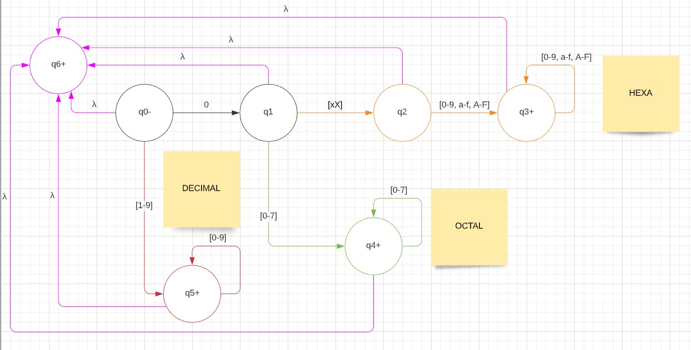
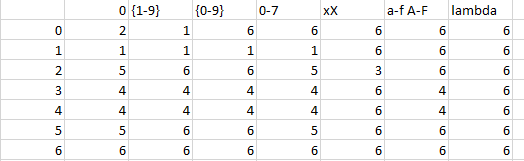

#  Reconociendo varios tipos de datos

**Breve explicación del codigo en C.**

Construimos un archivo txt "valores.txt" con muchos valores posibles separados por una coma. Para leer el mismo utilizamos las funciones
fopen, fseek (para posicionarnos al final del archivo), ftell (obtener cantidad de caracteres totales) y fread. Además, usamos el putc para ingresar un caracter al txt final y el fputs para ingresar un string al mismo.

Definimos cada uno de los estados necesarios para las transiciones, además del inicial, final y el de rechazo. [s1, s2, s3, s4, s5, s6]. Una vez que termina de identificar el tipo de dato(viene coma), se identifica el estado final y se imprime el tipo de dato.

Se entra en un for hasta la cantidad de elementos que hay en el archivo, el cual contiene un if dependiendo si es un caracter de terminación o no. Dependiendo si lo leído un caracter, se reconocerá el estado que se encuentra, si es un caracter válido, y si se encuentra en el estado de rechazo. 
Si no es uno válido se bloqueará en el estado de rechazo hasta que se continue con el siguiente dato.

 

 
